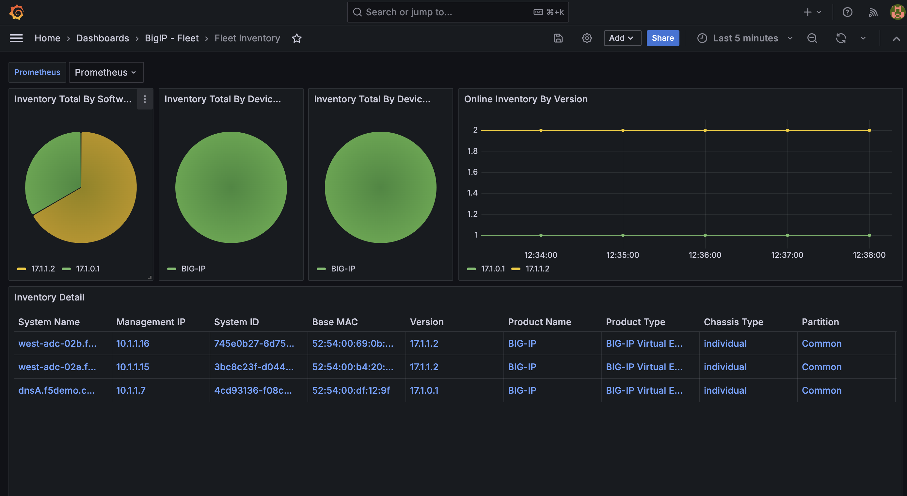
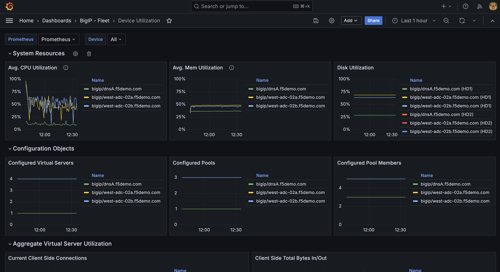
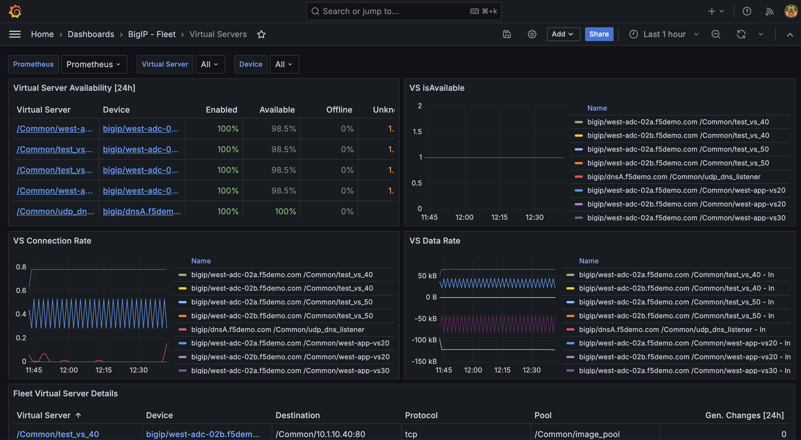
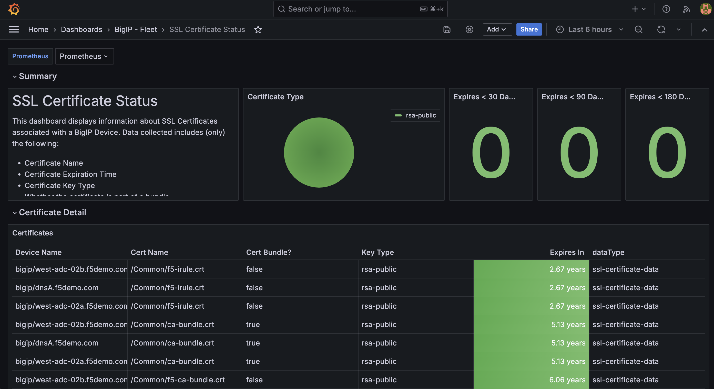
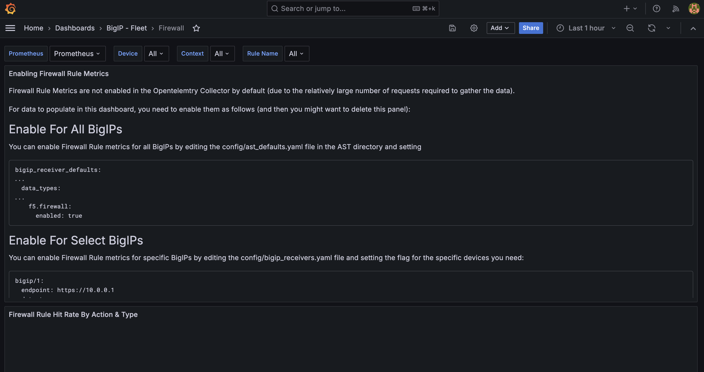
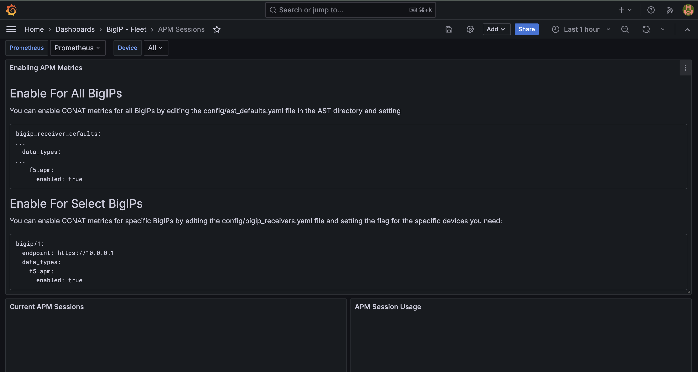
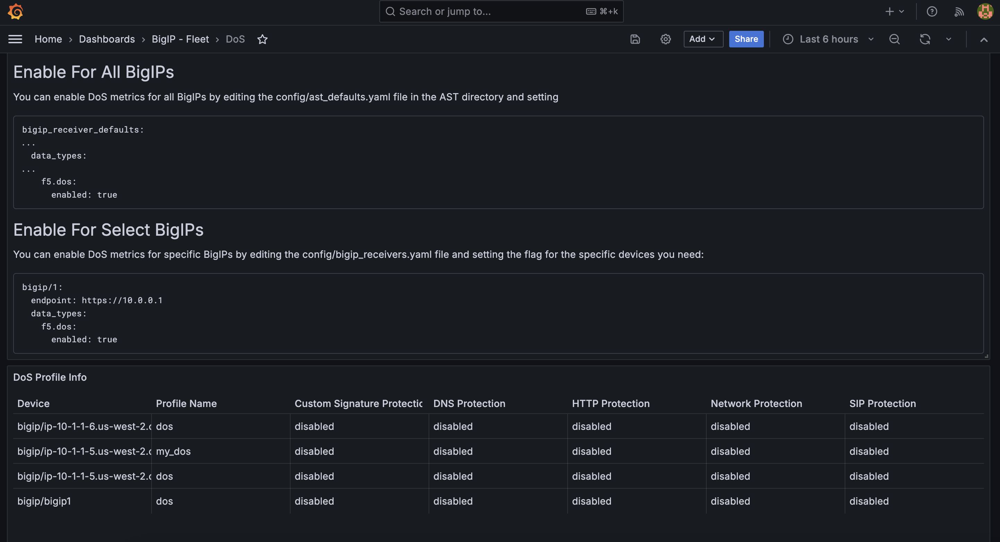
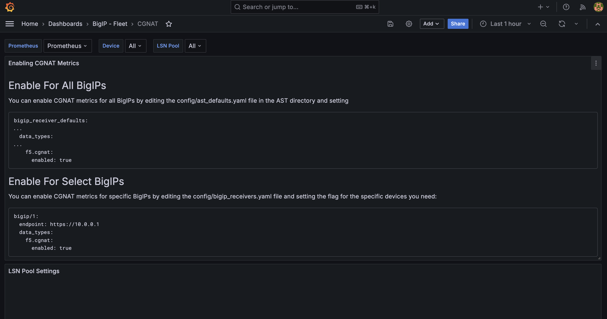

.. _BIG-IP - Fleet:

BIG-IP - Fleet Dashboards
=========================

In this lab, we'll explore the Application Study Tool's BIG-IP Fleet dashboards:

* Fleet Inventory
* Device Utilization
* Virtual Servers
* SSL Certificate Status
* Firewall
* APM Sessions
* DoS
* CGNAT

.. note:: There is an `exhaustive list of metrics <https://github.com/f5devcentral/application-study-tool/blob/main/pages/components/otel_collector/receiver_metrics.md>`_ collected, some of which have been exposed through the pre-built dashboards you are about to explore.

    These dashboards provide views into fundamental metrics we have observed have value in real-world scenarios, based upon field experience. We have designed this tool in a way that facilitates and enables users to customize it to meet their unique needs. Grafana provides just that, and we encourage you to add it to your toolbelt.

#. From the **Grafana Dashboards** landing page, select **BIG-IP - Fleet**

    .. image:: images/fleet_dashboards_link.png
        :width: 500

#. You'll be presented with a list of available dashboards:

    .. image:: images/fleet_dashboards.png
        :width: 500

Fleet Inventory
---------------

The **Fleet Inventory** dashboard is your one-stop shop for a list of all the F5 BIG-IPs in your estate from which F5 AST is collecting data.

Available Metrics include:

* Inventory Total by Software Version
* Inventory Total by Product Name
* Inventory Total by Product Type
* Online Inventory by Version
* Module Status
* Inventory Detail

Device Utilization
------------------

The **Device Utilization** dashboard contains data pertaining to metrics such as *resource utilization* and *F5 BIG-IP configuration objects*.

Available Metrics include:

* System Resources

  * Average CPU Utilization

  * Average Memory Utilization

  * Disk Utilization

* Configuration Objects

  * Configured Virtual Servers

  * Configured Pools

  * Configured Pool Members

* Average Virtual Server Utilization

  * Current Client Side Connections

  * Client Side Data Rate In/Out

Virtual Servers
---------------

The **Virtual Servers** dashboard give a view into *availability* and *connection/data rate* stats.

From here, you can also see *if changes have occurred within the past 24 hours* via the *Gen. Changes [24h]* column within the *Fleet Virtual Server Details* section, which answers one of the very first incident-triage questions... **what changed**?

Available Metrics include:

* Virtual Server Availability (24h)
* Is Virtual Server Available?
* Virtual Server Connection Rate
* Virtual Server Data Rate
* Fleet Virtual Server Details

SSL Certificate Status
----------------------

The **SSL Certificate Status** dashboard is both self-explanatory and extraordinarily helpful, especially when your F5 BIG-IP estate sprawls datacenters across the globe.

Available Metrics include:

* Summary

  * Certificate Type

  * Certs Expiring in less than 30 days

  * Certs Expiring in less than 90 days

  * Certs Expiring in less than 180 days

* Certificate Detail List

Firewall
--------

The **Firewall** dashboard is simple, straightforward, and eye-opening for organizations leaning on F5 BIG-IP to provide protection at layers three and four. Visit this dashboard to quickly obtain a view of firewall rule hits and assess trends. Although network and application attacks are becoming increasingly sophisticated, bad actors will almost certainly never stop attempting to exploit layer three/four vulnerabilities.

.. note:: One of the first things you'll notice about this dashboard is the presence of configuration instructions. Please take note of these and be sure your ``ast_defaults.yaml`` and ``bigip_receivers.yaml`` files are properly configured. Otherwise, stats will not be collected and displayed.

Available Metrics include:

* Firewall Rule Hit Rate by Action & Type
* Firewall Rule Hits (Last 1h)

APM Sessions
------------

The **APM Sessions** dashboard will be an area of focus for teams using their F5 BIG-IPs to wrap access policies and identity access management around applications. Understanding session usage and state enables administrators to analyze access policy trends and ensure proper sizing for concurrent connectivity units (CCUs). This aids in preventing hitting a CCU ceiling, which can result in rejected user connections and poor digital experiences.

.. note:: One of the first things you'll notice about this dashboard is the presence of configuration instructions. Please take note of these and be sure your ``ast_defaults.yaml`` and ``bigip_receivers.yaml`` files are properly configured. Otherwise, stats will not be collected and displayed.

Available Metrics include:

* Current APM Sessions
* APM Session Usage
* Current APM Access Sessions by State
* APM Access Sessions Usage

DoS
---

The **DoS** dashboard brings *Denial of Service* metrics to the forefront. This is a major area of focus especially for teams with F5 BIG-IPs deployed at or near the edge. There is great value in understanding the status of DoS mitigation efforts, and this dashboard helps deliver key stats.

.. note:: One of the first things you'll notice about this dashboard is the presence of configuration instructions. Please take note of these and be sure your ``ast_defaults.yaml`` and ``bigip_receivers.yaml`` files are properly configured. Otherwise, stats will not be collected and displayed.

Available Metrics include:

* DoS Profile Info
* DoS Stats Rate
* DoS Attacks Rate
* DoS Drops Rate
* DoS Stats by Vector
* DoS Attacks by Vector
* DoS Drops by Vector
* DoS BA Stats Rate
* DoS BA Detected Rate
* DoS BA Drops Rate
* DoS BD Stats Rate
* DoS BD Detected Rate
* DoS BD Drops Rate
* DoS Bytes Rate
* DoS Byte Drop Rate

CGNAT
-----

The **CGNAT** dashboard is geared toward delivery of *Carrier-Grade Network Address Translation* stats to folks in the service provider realm. Service providers run tight ships with serious SLAs and need the best possible performance for their customers, which is aided by the granular level of visibility found here.

.. note:: One of the first things you'll notice about this dashboard is the presence of configuration instructions. Please take note of these and be sure your ``ast_defaults.yaml`` and ``bigip_receivers.yaml`` files are properly configured. Otherwise, stats will not be collected and displayed.

Available Metrics include:

* LSN Pool Settings
* Pool Translations (Current)
* PBA Active Port Blocks
* Pool Translation Request Rate
* PBA Port Block Allocation Rate
* Port Translation Request Failure Rate
* PBA Port Block Allocation Failure Rate

Please select **Next** below and continue on to :ref:`BIG-IP - Device`.