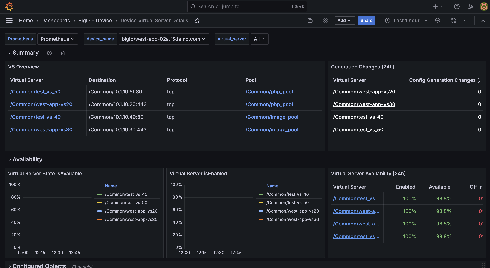

Lab 2 - Dashboards: BIG-IP - Device
===================================

In this lab, we'll explore the Application Study Tool's BIG-IP Device dashboards:

- Top N
- Device Overview
- Device WAF Overview
- Device Pools
- Device Virtual Servers
- Device Virtual Server Details
- Device iRules
- Device GTM

Top N
-----

.. image:: images/device_topn_dashboard.png
    :width: 800

Device Overview
---------------

.. image:: images/device_overview_dashboard.png
    :width: 800

Device WAF Overview
-------------------

.. image:: images/device_waf_overview_dashboard.png
    :width: 800

Device Pools
------------

.. image:: images/device_pools_dashboard.png
    :width: 800

Device Virtual Servers
----------------------

.. image:: images/device_virtual_servers_dashboard.png
    :width: 800

Device Virtual Server Details
-----------------------------

Device iRules
-------------

.. image:: images/device_irules_dashboard.png
    :width: 800

Device GTM
----------

.. image:: images/device_gtm_dashboard.png
    :width: 800
