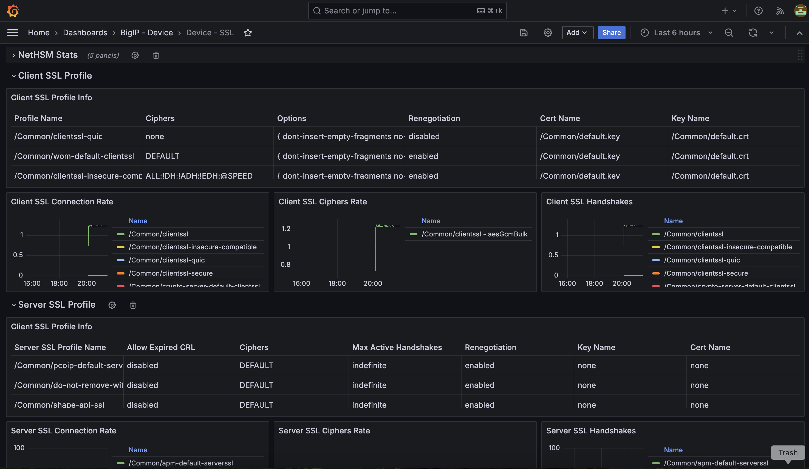

.. _BIG-IP - Device:

BIG-IP - Device Dashboards
==========================

In this lab, we'll explore the Application Study Tool's BIG-IP Device dashboards:

- Top N
- Device Overview
- Device WAF Overview
- Device Pools
- Device Virtual Servers
- Device iRules
- Device GTM
- Device SSL

.. note:: There is an `exhaustive list of metrics <https://github.com/f5devcentral/application-study-tool/blob/main/pages/components/otel_collector/receiver_metrics.md>`_ collected, some of which have been exposed through the pre-built dashboards you are about to explore.

    These dashboards provide views into fundamental metrics we have observed have value in real-world scenarios, based upon field experience. We have designed this tool in a way that facilitates and enables users to customize it to meet their unique needs. Grafana provides just that, and we encourage you to add it into your toolbelt.

#. From the **Grafana Dashboards** landing page, select **BIG-IP - Device**

    .. image:: images/device_dashboards_link.png
        :width: 500

#. You'll be presented with a list of available dashboards:

    .. image:: images/device_dashboards.png
        :width: 500

Top N
-----

The **Top N** dashboard aggregates a number of Top 10 impactful metrics, such as *Top 10 VIPs by CPU Utilization* and *Top 10 Virtual Servers By Low Availability*.

Available Metrics include:

* CPU Utilization

  * Top 10 VIPs by CPU Utilization

  * Top 10 Processes by CPU

  * Analysis, Control, and Data Plane Utilization

  * Top 10 VIPs by WAF CPU Utilization

* Top Pools / Members

  * Top 10 Pools by Active Connections

  * Top 10 Pool Members by Active Connections

* Availability

  * Top 10 Virtual Servers By Low Availability (last 24 hours)

  * Top 10 Virtual Servers By Low Availability (last 14 days)

  * Top 10 Pools By Low Availability (last 24 hours)

  * Top 10 Pools By Low Availability (last 14 days)

  * Top 10 Pool Members By Low Availability (last 24 hours)

  * Top 10 Pool Members By Low Availability (last 14 days)

* Top VIPs

  * Top 10 VIPs by SSL TPS Utilization

  * Top 10 VIPs by Bandwidth

  * Top 10 VIPs by Object Count

  * Top 10 VIP-Applied Profile Types

* iRule Utilization

  * Top 10 iRules by Cycles Per Execution

  * Top 10 iRules by Execution Count

  * Top 10 iRules by Approximate Cycles Used (last 24 hours)

.. image:: images/device_topn_dashboard.png
    :width: 800

Device Overview
---------------

The **Device Overview** dashboard is where the nitty-gritty of each individual F5 BIG-IP is exposed.

Available Metrics include:

* Device Overview

  * Device Status

  * Connection Info

  * License State

  * Average CPU Utilization

  * Memory Utilization

  * Disk Usage

  * Failover Peer

  * Version

* Device Resources

  * CPU Utilization

  * SubSystem CPU Utilization

  * SubSystem Memory Utilization

  * Top 10 Processes by CPU

  * Top 10 Processes by Memory

  * Memory Utilization

  * Average CPU Utilization

  * Disk Usage

* Device Virtual Servers

  * VS Overview

  * VS Data Rate

  * VS Concurrent Connections

* Device Network

  * Network Addresses

  * Network Interface Data Rate

  * VLAN Info

  * Network Interface Error Rate

Device WAF Overview
-------------------

Security-minded folks in the room will thoroughly enjoy F5 AST's **Device WAF Overview** dashboard.

Available Metrics include:

* WAF Events

  * WAF Event Rate

  * Incident Count (last hour)

  * Bot Event Count (last hour)

  * Bot Incident Count (last hour)

  * Brute Force Attack Count (last hour)

  * Incident Count (last 24 hours)

  * Bot Event Count (last 24 hours)

  * Bot Incident Count (last 24 hours)

  * Brute Force Attack Count (last 24 hours)

* ASM Policy Detail

  * WAF Feature Status

  * Applied Virtual Servers

  * Signature Set Count by State

  * Signature Set Count

  * Parameter Checking Count

Device Virtual Servers
----------------------

Another incredibly self-evident dashboard, **Device Virtual Servers** is a looking glass to the front-end ingress point for your F5 BIG-IP. Here, metrics such as *Configuration Changes (last 24 hours)* and *Applied iRules* can be found.

Available Metrics include:

* Summary

  * Virtual Server Overview

  * Configuration Changes (last 24 hours)

* Availability

  * Is Virtual Server State Available?

  * Is Virtual Server Enabled?

  * Virtual Server Availability (last 24 hours)

* Configured Objects

  * Virtual Server Pool State

  * Applied iRules

  * Applied Profiles

* CPU Utilization

  * Virtual Server CPU Utilization

  * Virtual Server ASM CPU Utilization

* Traffic

  * Virtual Server Request Rate

  * Virtual Server Traffic

  * Virtual Server Packets Rate

* Connections

  * Virtual Server Concurrent Connections

  * Virtual Server Connection Rate

  * Virtual Server Average Connection Duration

* HTTP

  * HTTP Requests & Responses per Second

  * HTTP Responses per Second

* DNS

  * Profiles

  * DNS Latencies per millisecond

  * DNS Queries & Responses per Second

  * DNS Express Queries & Responses per Second

* SSL

  * SSL Bytes per Second

  * SSL Handshakes and Renegotiations per Second

.. image:: images/device_virtual_servers_dashboard.png
    :width: 800

Device Pools
------------

The **Device Pools** dashboard tunes users directly into the back-end resources your business needs to function.

Available Metrics include:

* Summary

  * Pool Overview

  * Configuration Changes (last 24 hours)

* Pool Availability

  * Is Pool State Available?

  * Active Pool Members

  * Pool Availability (last 24 hours)

* Pool Utilization

  * Pool Data Rate

  * Active Pool Connection Count

  * Pool Request Rate

* Pool Member Availability

  * Is Pool Member State Available?

  * Pool Member Availability (last 24 hours)

* Pool Member Utilization

  * Pool Member Data Rate

  * Active Pool Member Connections

  * Pool Member Request Rate

.. image:: images/device_pools_dashboard.png
    :width: 800

Device iRules
-------------

The **Device iRules** dashboard should come as no surprise to anyone familiar with F5 BIG-IP. iRules are an integral part of powering application delivery, and having operational state data such as *iRule Execution Rate* and *iRule Failure Rate* is critical and revealing. You can even dig deeper and learn about *Failures by Event Type*.

Available Metrics include:

* Overview

  * Top 10 iRules by Approximate Cycles Used (last 24 hours)

  * Top 10 iRules by Cycles per Execution

  * Top 10 iRules by Executions

  * iRule Execution Rate

  * iRule Failure Rate

  * iRule Abort Rate

* Rule Event Detail

  * Executions by Event Type

  * Failures by Event Type

  * Aborts by Event Type

.. image:: images/device_irules_dashboard.png
    :width: 800

Device GTM
----------

The **Device GTM** dashboard provides a view of the DNS and global resiliency metrics across your F5 BIG-IP estate.

.. note:: One of the first things you'll notice about this dashboard is the presence of configuration instructions. Please take note of these and be sure your ``ast_defaults.yaml`` and ``bigip_receivers.yaml`` files are properly configured. Otherwise, stats will not be collected and displayed.

Available Metrics include:

* GTM Overview

* Requests Rate by Type

.. image:: images/device_gtm_dashboard.png
    :width: 800

Device SSL
----------

Last, but certainly not least, the **Device SSL** dashboard gives administrators a view of NetHSM statistics as well as client and server SSL profile data and stats. This is a very important area of focus, as BIG-IP is almost always used as a means by which to offload SSL operations and break/inspect application traffic.

Available Metrics include:

* NetHSM Stats

  * Async Queue Done Rate

  * Async Queue Current Queued

  * Async Queue Average Queue Time

  * PKCS11d Operations Rate

  * PKCS11d Error Rate

* Client SSL Profile

  * Client SSL Profile Info

  * Client SSL Connection Rate

  * Client SSL Ciphers Rate

  * Client SSL Handshakes

* Server SSL Profile

  * Server SSL Profile Info

  * Server SSL Connection Rate

  * Server SSL Ciphers Rate

  * Server SSL Handshakes Rate

Please select **Next** below and continue on to :ref:`Device/Profiles`.