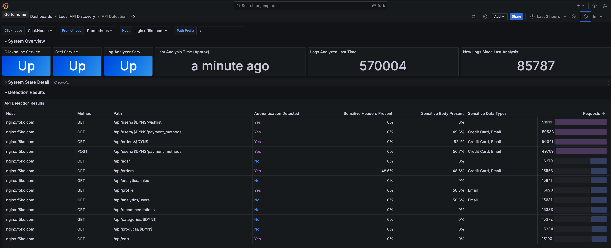
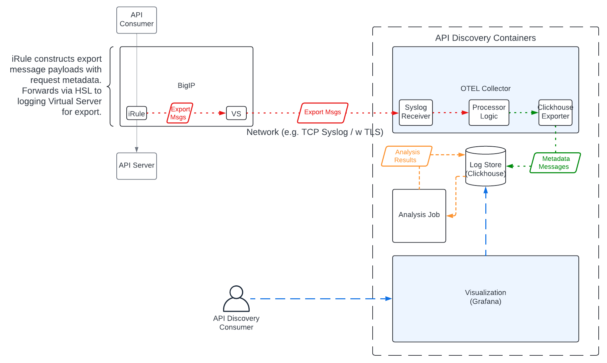

.. _LADT - Overview:

F5 LADT Overview
================

In this lab, we'll run through an overview of the **F5 Local API Discovery Tool**. At a high level, the **F5 LADT** is:

*The AST Local API Discovery Tool (LADT) is a fork of the Application Study Tool focused on analyzing data about customer APIs based on data from classic F5 BIG-IP logs.*

*The LADT receives per-http-request data from F5 BIG-IP devices and stores relevant fields for periodic batch analysis. Output of the analysis is a list of likely API endpoints, whether or not they are authenticated, and the number of requests processed by each endpoint. API detection logic is based on a subset of official F5 product offerings, with some advanced functionality (e.g. schema discovery and Machine Learning analysis) excluded for performance reasons.*

Example API Detection Output
----------------------------

System Overview
---------------

The F5 LADT relies on a specially-crafted iRule to export per-request metadata to the analysis system, running on-prem. The analysis system consists of:

- Opentelemetry Collector: For receiving incoming logs, processing, and forwarding them to storage system
- ClickHouse Database: For storing log data and running analysis queries
- Analysis Job: Runs periodically to generate results
- Grafana: For visualizing results, and system component states

System Prerequisites and Recommendations
----------------------------------------

- Linux system with docker (or compatible) - Installation Instructions
- F5 BIG-IP with logging iRule (contact your F5 Team for access)
- Network connectivity (default TCP port 6514) between the BigIP and instance running LADT

Minimal system specs for running the Local API Discovery Tool will depend heavily on expected traffic load.

The following performance characteristics were observed with an Intel(R) Xeon(R) Gold 6138 CPU @ 2.00GHz running localized testing
(single TCP+TLS connection meant to simulate a stream of data from a single BigIP Device). Actual message throughput
under real world network conditions would likely be quite a bit lower.

.. list-table:: Performance Characteristics
   :widths: 15 25 25 25 25
   :header-rows: 1

   * - Msg/Sec
     - Collector CPU Util
     - Clickhouse CPU Util
     - Collector Mem Util
     - Clickhouse Mem Util
   * - 0
     - 0.5%
     - 0.8%
     - 40MiB
     - 546MiB
   * - 1
     - 0.7%
     - 1.3%
     - 41.5MiB
     - 629MiB
   * - 10
     - 0.8%
     - 1.6%
     - 58MiB
     - 629MiB
   * - 100
     - 1.7%
     - 1.8%
     - 66MiB
     - 646MiB
   * - 1000
     - 8%
     - 2.8%
     - 115MiB
     - 650MiB
   * - 10000
     - 59.3%
     - 40%
     - 176MiB
     - 698MiB
   * - 20000
     - 133%
     - 44%
     - 216MiB
     - 750MiB
   * - 30000
     - 180%
     - 47%
     - 216MiB
     - 798MiB
   * - 40000
     - 235%
     - 70%
     - 225MiB
     - 948MiB
   * - 54000
     - 298%
     - 106%
     - 245MiB
     - 1000MiB

The analysis script adds an additional ~10% CPU and 250MiB of load to the clickhouse instance while performing analysis.

.. list-table:: Analysis Characteristics
   :widths: 25 25
   :header-rows: 1

   * - Analyzed Messages
     - Analysis Duration Sec
   * - 1000
     - 113ms
   * - 10000
     - 0.9s
   * - 10000
     - 6.67s
   * - 20000
     - 14.7s
   * - 1.04M
     - 1.12min
   * - 2.2M
     - 2.51min
   * - 10M
     - 4.06min

Disk space usage likewise depends on volume, but clickhouse provides a good amount of compression (here 758 million entries are stored in ~210MiB).

.. list-table:: Disk Space Usage
   :widths: 15 15 15 15 15 15
   :header-rows: 1

   * - Rows
     - Disk Size
     - Bytes Size
     - Compressed Size
     - Uncompressed Size
     - Ratio
   * - 758799480
     - 210.24MiB
     - 220452423
     - 209.25 MiB
     - 21.16 GiB
     - 0.00965486284484136

.. note:: As previously mentioned, we won't get digging into the installation details or process within this lab module.
    
    If you're interested in going down that path and learning more, please get in touch with your F5 account team and inquire about F5 LADT.

Select **Next** below for to learn how to access the F5 LADT Grafana instance in the UDF lab environment.