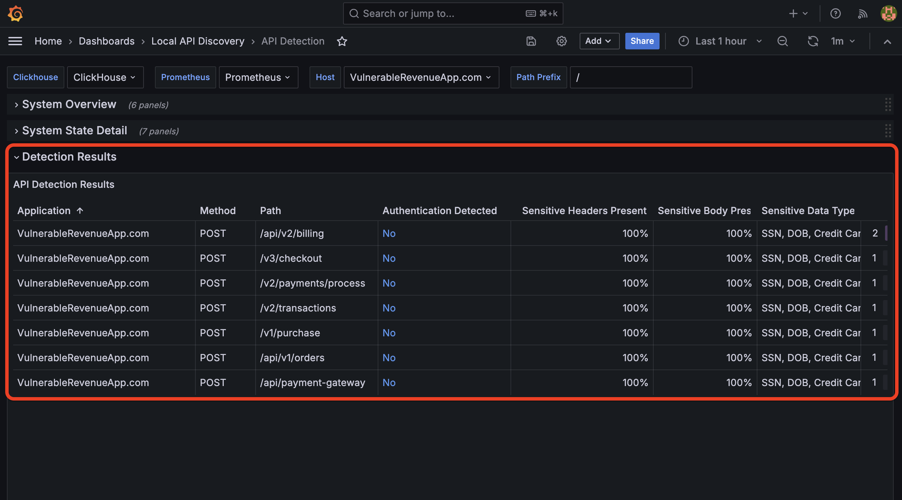
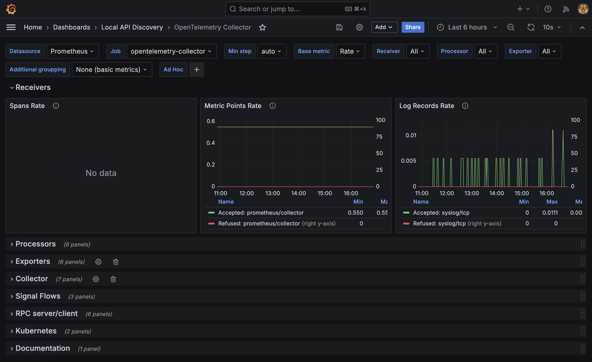

.. _LADT - Grafana Instance Access:

Accessing the F5 LADT Instance Dashboards
=========================================

We've pre-provisioned an instance of F5 LADT in the UDF lab environment. It's ready for you to dive in and take a look. Just follow the instructions below!

Accessing F5 LADT Grafana Instance
----------------------------------

#. From within the UDF course deployment's **LADT** System, locate and select **ACCESS**, then **Grafana**.

    .. image:: images/udf_ladt_grafana_access.png
        :width: 800

#. Once the new browser tab has loaded, you will be presented with the self-installed F5 LADT Grafana login. Enter the following credentials and select **Log in**.

    Username

    .. code-block:: console

        admin

    Password

    .. code-block:: console

        11F5Networks11

    .. image:: ../module2/images/grafana_login.png
        :width: 800

#. You'll be presented with the Grafana homepage. From here, select the hamburger menu next to **Home** in the upper left corner, then **Dashboards**

    .. image:: images/ladt_grafana_home.png
        :width: 800

#. Once the Dashboards page has loaded, you can either expand the list of dashboards by selecting the **>** symbol next to **Local API Discovery** or selecting the **Local API Discovery** folder itself.

    .. image:: images/ladt_dashboards.png
        :width: 800

API Detection Dashboard
-----------------------

The **API Detection Dashboard** has three sections, as outlined below. Contract the *System Overview* and *System State Detail* sections by selecting the **v** next to each section title, as we're more interested in the *Detection Results*.

* System Overview

  * Clickhouse Service Status

  * OTel Service Status

  * Log Analyzer Status

  * Last Analysis Time

  * Logs Analyzed Last Time

  * New Logs Since Last Analysis

* System State Detail

  * Analysis Settings

  * Logs Last Processed by Host

  * Logs Received

  * Logs Processed at Last Analysis

  * Last Analysis Duration

  * CPU Utilization

  * Memory Usage

* Detection Results

  * Application Name

  * HTTP Method

  * Path

  * Authentication Detected

  * Sensitive Headers Present

  * Sensitive Body Present

  * Sensitive Data Types

  * # of Requests

As detailed above, **Detection Results** is where all of the API endpoints and their detected properties will be listed. Straight away, you will be able to get a view of the number of requests an API resource has seen for a given method and whether or not sensitive data or headers have been detected.

ClickHouse Dashboard
--------------------

**ClickHouse** is the software used to store logs and perform analysis queries. Its dashboard has 12 sections, which are listed below. This is not necessarily an aspect of the tool we expect students and administrators to interact with on a regular basis. However, it's a good idea to understand the scope of which metrics are captured and represented here in the event troubleshooting is required.

* System Metrics

  * Nodes

  * Memory

  * Connections

  * Read backoff

  * Slow reads

* Queries

* Insert

* Select

* IO

* Replicas

* Merge

* Cache

* Parts

* Distributed

* Background pool

* Zookeeper

.. note:: Many (if not all) of the metrics found within this dashboard may be foreign and daunting if you're not already familiar with **ClickHouse** and/or databases in general.
    
    If you would like to get a better understanding of their role, contextual information is available via the *information icon* to the right of each metric label. Hover over the icon to view tooltip details. 

.. attention:: References to *clickhouse:9126* indicate the default port upon which the **ClickHouse** runs: *9126*

OpenTelemetry Collector Dashboard
---------------------------------

The **OpenTelemetry Collector Dashboard** contains all information pertaining to the *OTel Collector* employed in receiving, processing, and forwarding incoming logs to the storage system (ClickHouse). This dashboard contains the following eight sections:

There's a section dedicated to *documentation*, should you have the desire to learn more about telemetry metrics collection!

* Receivers

* Processors

* Exporters

* Collector

* Signal Flows

* RPC server/client

* Kubernetes

* Documentation

.. note:: As mentioned within the **ClickHouse Dashboards** portion above, you may obtain a better understanding of OTel Collector metric roles via the *information icon* to the right of each metric label. Hover over the icon to view tooltip details. 

That's a wrap for the **F5 Application Study Tool Introduction** class, folks. Check back often for updates to the guide, as we have exciting plans for future labs!

Our **appreciation** for *your* **time** and **energy** goes *beyond what words can convey*.

.. attention:: We would like to encourage you to provide feedback through your account team and also the GitHub repos, should you encounter issues or have enhancement requests!